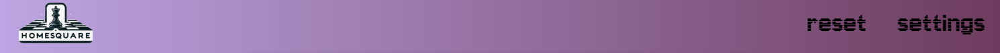
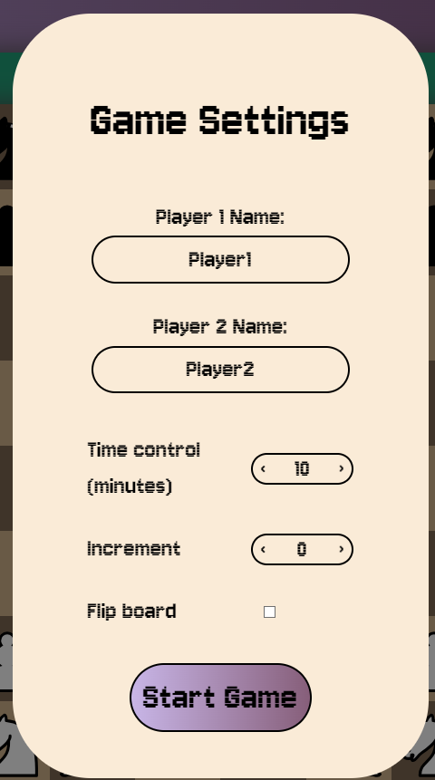
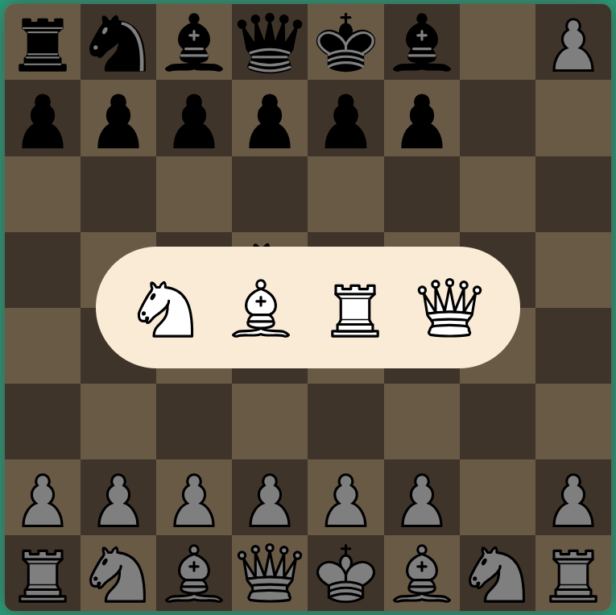
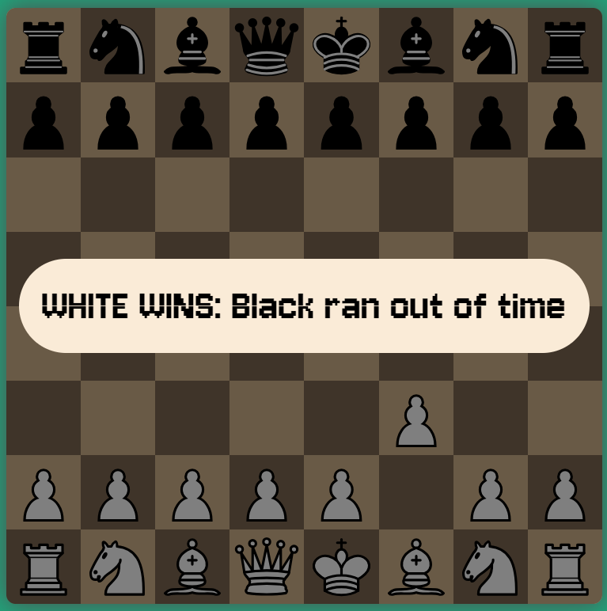
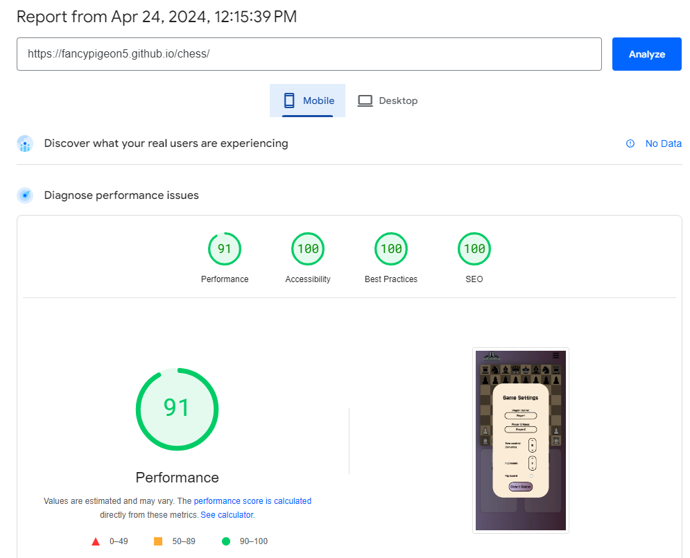
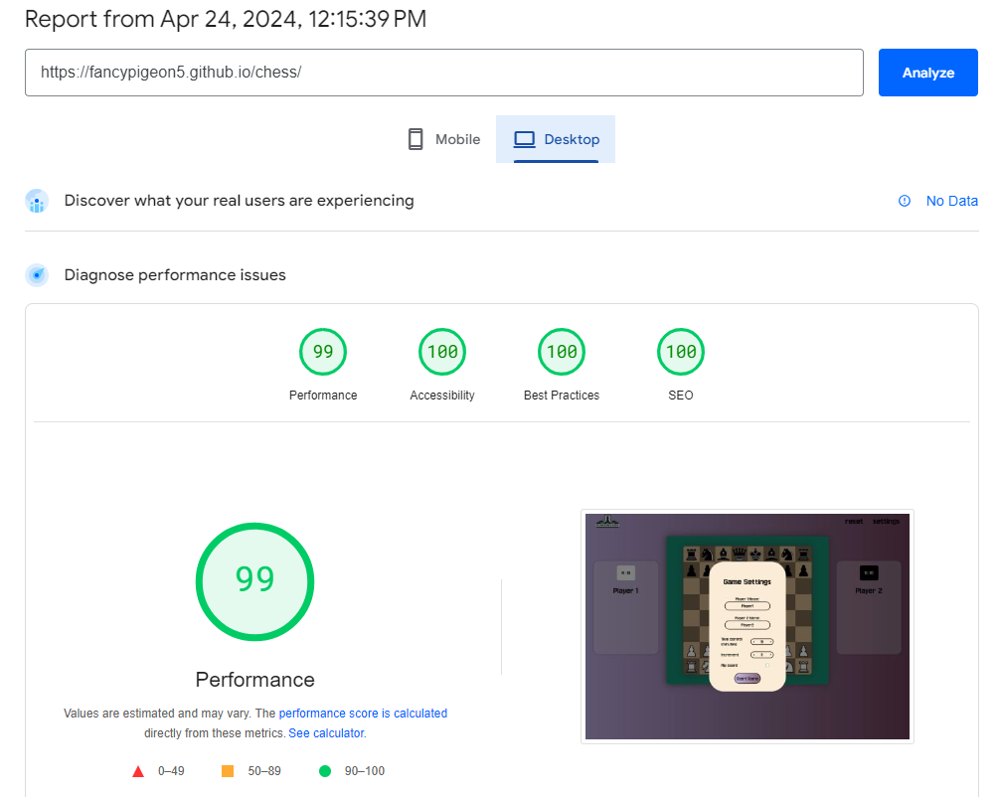

# Homesquare chess

Homesquare Chess is designed to be an object-oriented JavaScript chess board. The project's goal is to establish an online platform where users can enjoy local chess games with friends and family. Additionally, it seeks to apply various fundamental JavaScript concepts through clear object-oriented coding to deliver a fully functional chessboard. This board will incorporate all essential chess rules, including piece movement, checks, draws, checkmates, and more.

## Features

### Existing features

- __Header__

    - At the top of the page we find the header containing a logo and a nav section that lets players reset the board or access the settings.

    

- __Player info__

    - These sections display the players names and a timer to display the time they have left.

    
    

- __Settings section__

    - This section comes up as an overlay over the rest of the site.

    - This section lets the user change some parts of the User experience and/or gameplay: 

        - The names displayed.

        - The amount of time each player is given.

        - The amount of extra seconds players earn with each move.

        - Whether or not the board should flip after each move.
    
    - After clicking the start game button these settings will be applied

    

- __The board area__

    - This is the section where the chess board will be displayed and the game will be played.

    - The two players wil be able to take alternating turns making their moves.

    - When clicked a piece will display all the possible legal moves it can make.

    

- __Promotion overlay__

    - This section is an overlay that appears when a pawn makes it to the other side of the board.

    - This section presents the player with the possible pieces the pawn can turn into when clicked.

    

- __End of game overlay__

    - These overlays pop up whenever an end of game condition is met.

    - Win conditions are: 

        - When a player is in check and there are no ways of escaping it.
        

        - When a player runs out of time.
        

    - Draw conditions are:

        - When the same position is reached 3 times this game.
        

        - When there have been 50 full moves without any captures.
        

        - When on a player's turn, they have no legal moves left but are not currently in check.
        
    

### Features left to implement

- Connecting to a chessbot api to be able to play against the computer.

- Captured pieces appear in the player info under their name.

- Moves get written down in chess notation below the board. 

## UX Design

___

### Strategy

- I want to build an web application where people can come to play a game of chess together. The other aim of the application is to explore the possibilities of JavaScript by building a fully functional chessboard using only vanilla JS and trying to take an OO approach.

### Scope

- The website itself will be very minimal and provide just enough for the user to be able to setup and play a game of chess.

### structure

- The site will be easy to use with a single page design and a settings menu that will be presented as a pop-up. All options given to the user should be clear in what they do

### Skeleton

- The page wil have a very clear design with only a few important aspects:

    - Header with logo and reset/settings links.
    
    - The board

    - Player info for both sides with a clock and the players name

### surface

#### Colors

- I want to give the site a bit of a retro feeling by choosing a purple gradient as the main background and on laptop and desktop a green feild where the board will be presented.

- the colors for the chess board are a lighter and darker brown to give it the same tones as a real wooden board, and the pieces are given the standard black and white sides.

- Green, Yellow and Red highlights are used to represent possible moves, current selected piece and check respectively.

#### typography

- For the entire page I opted for the font Jersey 10 from google fonts because it adds to the retro vibe of the site.

## Testing

### Tests

- __All the tests can be found in [this file](readme-assets/testing/testing.md).__

### Validators

- I used the W3 validator for both HTML and CSS

    - HTML: As shown in the screenshot below it passed all tests
    

    - CSS: As shown in the screenshot below it passed all tests
    

    - JS: As shown in the screenshot below it passed all tests
    
    

### Performance

- To check the performance of the page we used PageSpeed which tests for both mobile and desktop. We got an acceptable score both on mobile and on desktop.

### Compatibility

- I tested the site on several different browsers (Chrome, Firefox, Opera and Safari) and did not notice any problems on Different browsers.

### Responsiveness

- I tested the site on a number of different screen sizes ranging from very small screens e.g. iPhone 5 (320px wide) to very large screens e.g. 5K iMac Pro (5120 x 2880 px).

## Deployment

### How the page is deployed

- In the GitHub repository, navigate to the Settings tab, then choose Pages from the left hand menu 
- From the source section drop-down menu, select the Master Branch
- Once the master branch has been selected, the page will be automatically refreshed with a detailed ribbon display to indicate the successful deployment
- Any changes pushed to the master branch will take effect on the live project

### How to clone the repository

- Go to the repository on GitHub 
- Click the "Code" button to the right of the screen, click HTTPs and copy the link there
- Open a GitBash terminal and navigate to the directory where you want to locate the clone
- On the command line, type "git clone" then paste in the copied url and press the Enter key to begin the clone process

## Credits

### Content

- [W3 Schools](https://www.w3schools.com): They prodided a lot of documentation on basic JS concepts whitch helped a lot. [This example](https://www.w3schools.com/howto/howto_css_hide_arrow_number.asp) I used to style the arrows on the number type inputs. 

- [Stackoverflow](https://stackoverflow.com): A few times while experiencing a problem, this site was very useful to find others experiencing simular issues.

- [MDN wbe docs](https://developer.mozilla.org/en-US/): Just like w3 this site helped to understand some core concepts by providing well written documentation.

- [ChatGPT](https://chat.openai.com): Helped me in coming up with the name Homesquare.

- [Font Awesome](https://fontawesome.com): The burger icon for the navigation on mobile.

- [Google Fonts](https://fonts.google.com): The fonts used in the site are taken from Google fonts.

### Media

- The favicon was created by myself on inkscape.

- The chess pieces were taken from [wikimedia](https://commons.wikimedia.org/wiki/Category:SVG_chess_pieces) and are free to use.

- The logo is custom generated by ChatGPT.