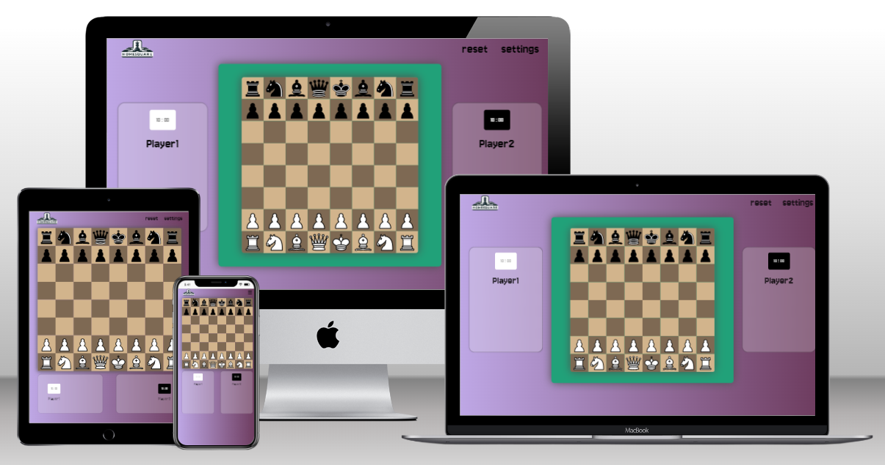
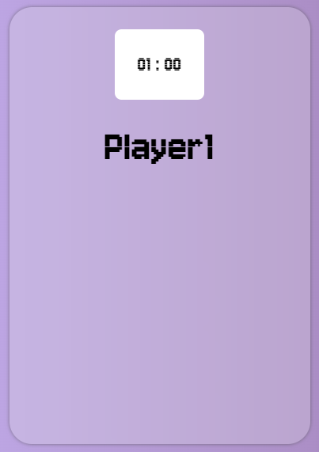
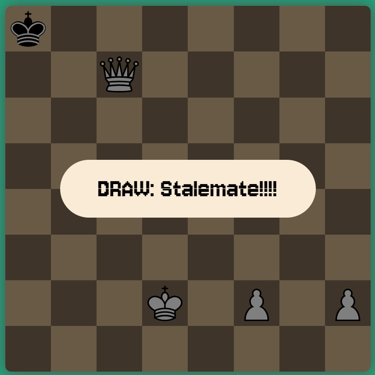

# Homesquare chess

Homesquare Chess is designed to be an object-oriented JavaScript chess board. The project's goal is to establish an online platform where users can enjoy local chess games with friends and family. Additionally, it seeks to apply various fundamental JavaScript concepts through clear object-oriented coding to deliver a fully functional chessboard. This board will incorporate all essential chess rules, including piece movement, checks, draws, checkmates, and more.

## Features

### Existing features

- __Header__

    - At the top of the page we find the header containing a logo and a nav section that lets players reset the board or access the settings.

    

- __Player info__

    - These sections display the players names and a timer to display the time they have left.

    
    

- __Settings section__

    - This section comes up as an overlay over the rest of the site.

    - This section lets the user change some parts of the User experience and/or gameplay: 

        - The names displayed.

        - The amount of time each player is given.

        - The amount of extra seconds players earn with each move.

        - Whether or not the board should flip after each move.
    
    - After clicking the start game button these settings will be applied

    

- __The board area__

    - This is the section where the chess board will be displayed and the game will be played.

    - The two players wil be able to take alternating turns making their moves.

    - When clicked a piece will display all the possible legal moves it can make.

    

- __Promotion overlay__

    - This section is an overlay that appears when a pawn makes it to the other side of the board.

    - This section presents the player with the possible pieces the pawn can turn into when clicked.

    

- __End of game overlay__

    - These overlays pop up whenever an end of game condition is met.

    - Win conditions are: 

        - When a player is in check and there are no ways of escaping it.
        

        - When a player runs out of time.
        

    - Draw conditions are:

        - When the same position is reached 3 times this game.
        

        - When there have been 50 full moves without any captures.
        

        - When on a player's turn, they have no legal moves left but are not currently in check.
        
    

### Features left to implement

- Connecting to a chessbot api to be able to play against the computer.

- Captured pieces appear in the player info under their name.

- Moves get written down in chess notation below the board. 

## UX Design

___

### Strategy

### Scope

### structure

### Skeleton

### surface

#### Colors

#### typography

## Testing

### Tests

- __All the tests can be found in [this file](readme-assets/testing/testing.md).__

### Validators

- I used the W3 validator for both HTML and CSS

    - HTML: As shown in the screenshot below it passed all tests
    

    - CSS: As shown in the screenshot below it passed all tests
    

    - JS: As shown in the screenshot below it passed all tests
    
    

### Performance

### Compatibility

I tested the site on several different browsers (Chrome, Firefox, Opera and Safari) and did not notice any problems on Different browsers.

## Deployment

### How the page is deployed

- In the GitHub repository, navigate to the Settings tab, then choose Pages from the left hand menu 
- From the source section drop-down menu, select the Master Branch
- Once the master branch has been selected, the page will be automatically refreshed with a detailed ribbon display to indicate the successful deployment
- Any changes pushed to the master branch will take effect on the live project

### How to clone the repository

- Go to the repository on GitHub 
- Click the "Code" button to the right of the screen, click HTTPs and copy the link there
- Open a GitBash terminal and navigate to the directory where you want to locate the clone
- On the command line, type "git clone" then paste in the copied url and press the Enter key to begin the clone process

## Credits

### Content

### Media

